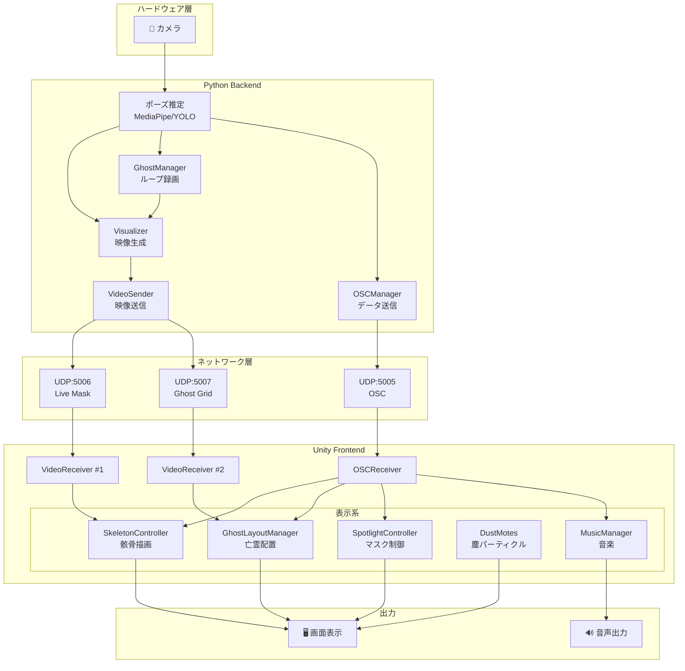
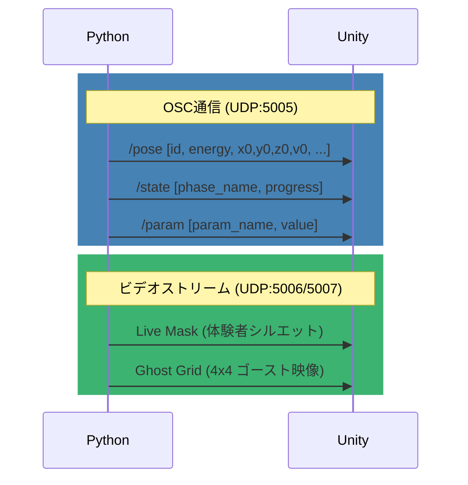
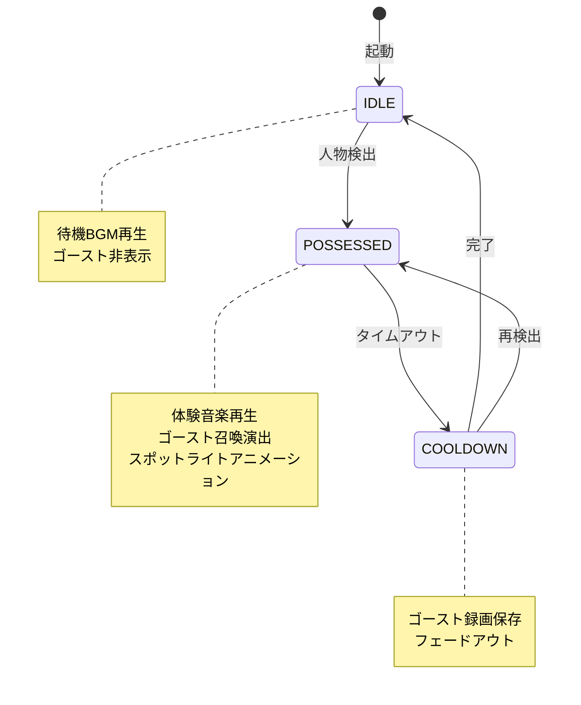
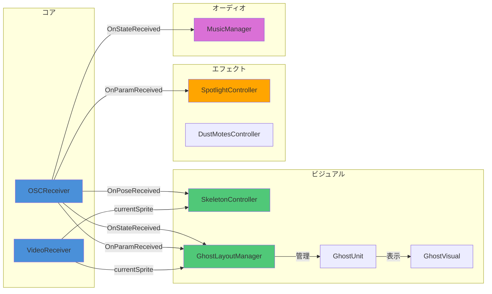
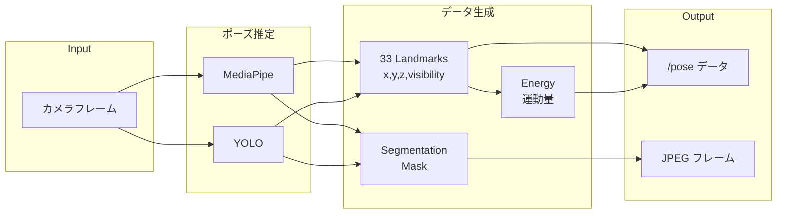
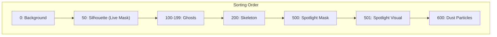
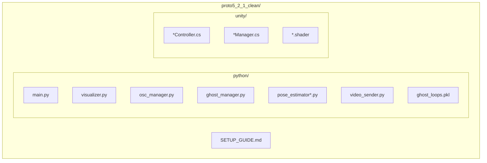

# Proto 5.2.1 システムアーキテクチャ

---

## 🏗️ 全体アーキテクチャ



---

## 📡 通信プロトコル



---

## 📦 レイヤーアーキテクチャ

```mermaid
graph TB
    subgraph L1["入力層"]
        I1[カメラ入力]
        I2[OSCコマンド]
    end

    subgraph L2["処理層 (Python)"]
        P1[ポーズ推定]
        P2[セグメンテーション]
        P3[ゴースト管理]
        P4[映像合成]
    end

    subgraph L3["通信層"]
        C1[OSC (骨格/状態/パラメータ)]
        C2[Video (マスク/グリッド)]
    end

    subgraph L4["表示層 (Unity)"]
        U1[骸骨レンダリング]
        U2[ゴーストレンダリング]
        U3[エフェクト<br/>スポットライト/塵]
        U4[音楽制御]
    end

    subgraph L5["出力層"]
        O1[画面出力]
        O2[音声出力]
    end

    I1 --> P1
    I1 --> P2
    I2 --> P4
    P1 --> P3
    P2 --> P4
    P3 --> P4
    P1 --> C1
    P4 --> C2
    C1 --> U1
    C1 --> U4
    C2 --> U1
    C2 --> U2
    U1 --> O1
    U2 --> O1
    U3 --> O1
    U4 --> O2
```

---

## 🎭 ゲームフェーズ状態遷移



---

## 🔗 Unityコンポーネント依存関係



---

## 📊 データフロー詳細



---

## 🎨 レンダリング階層



---

## 📁 ファイル構成


